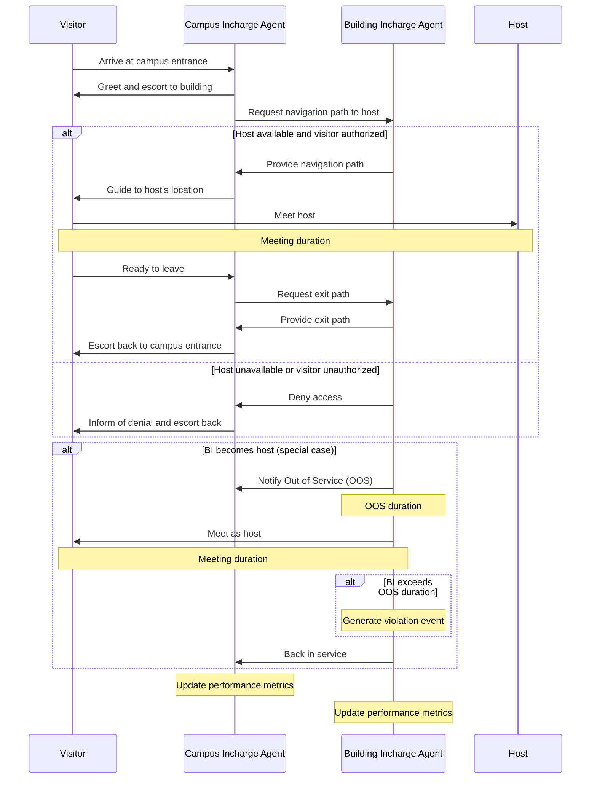

# Multi-GPT

```mermaid
sequenceDiagram
    participant V as Visitor
    participant CI as Campus Incharge Agent
    participant BI as Building Incharge Agent
    participant H as Host

    V->>CI: Arrive at campus entrance
    CI->>V: Greet and escort to building
    CI->>BI: Request navigation path to host
    alt Host available and visitor authorized
        BI->>CI: Provide navigation path
        CI->>V: Guide to host's location
        V->>H: Meet host
        Note over V,H: Meeting duration
        V->>CI: Ready to leave
        CI->>BI: Request exit path
        BI->>CI: Provide exit path
        CI->>V: Escort back to campus entrance
    else Host unavailable or visitor unauthorized
        BI->>CI: Deny access
        CI->>V: Inform of denial and escort back
    end

    alt BI becomes host (special case)
        BI->>CI: Notify Out of Service (OOS)
        Note over BI: OOS duration
        BI->>V: Meet as host
        Note over BI,V: Meeting duration
        alt BI exceeds OOS duration
            Note over BI: Generate violation event
        end
        BI->>CI: Back in service
    end

    Note over CI: Update performance metrics
    Note over BI: Update performance metrics
```
